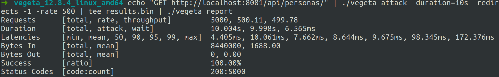
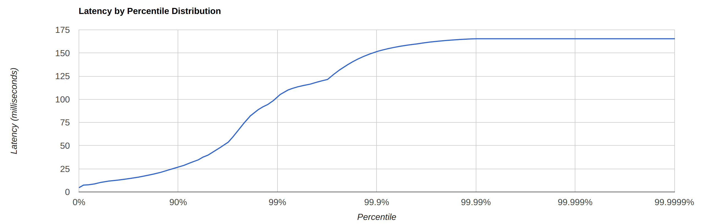

# Challenge for Java Fullstack Developer position @ Reba

REST API desarrollada con Java 11 + Spring Boot + Postgresql.

### Correr el proyecto local
Para correr la API solo hace falta ejecutar en la terminal los siguientes comandos
```bash
mvn compile
mvn exec:java -Dexec.mainClass=com.example.demo.DemoApplication 
-Dspring.profiles.active=dev
```
Los perfiles posibles son dev y prod.
dev apunta a una base postgres local que se llame 'challenge' con user y password 'postgres', mientras que prod apunta a la base de heroku

### [Documentacion](https://reba-challenge.herokuapp.com/swagger-ui/index.html)
El proyecto cuenta con documentacion en swagger.
Para acceder hay que correr la API e ingresar al endpoint '/swagger-ui'

En el deploy de heroku, para ver la documentacion de manera adecuada se debe escribir en la barra de busqueda de la navbar '/challenge-api.yaml'

### Deploy
Se configuro un Pipeline de CI con github actions para correr el build y los 
tests a la hora de hacer un pull request o un push a la branch master. 
Una vez que estos checks corren de manera satisfactoria, se deployea el ultimo
commit de master en la plataforma Heroku.

https://reba-challenge.herokuapp.com

No se precisan credenciales para utilizar la api

### Performance test
Se utilizo la herramienta [Vegeta](https://github.com/tsenart/vegeta) para realizar stress test a la api y ver como reacciona


Podemos oberservar que al realizar 500 GETS por segundo al endpoint de /personas el 99.9% de las llamadas estuvieron por debajo de los 150ms, siendo el maximo 172ms.
### Mejoras posibles

Algunas mejoras que se pueden realizar al proyecto:
- Agregar tests de unidad que cubran una mayor parte de la app y casos border.
- Al realizar POST a /personas, se deberia devolver la entidad con el ID, aunque no es algo trivial de realizar (ya que el ID se genera luego de realizar el flush y springdata abstrae bastante las transacciones), es algo posible y brinda una mejor experiencia.
- Permitir mayor flexibilidad a la hora de ingresar fechas. Al usar LocalDateTime, se debe ingresar las fechas con un formato similar a "2020-04-19T00:00" lo cual hace que sea poco practico